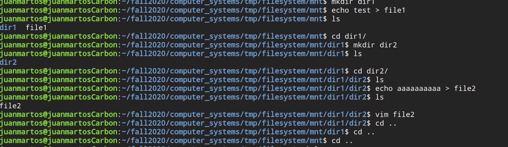
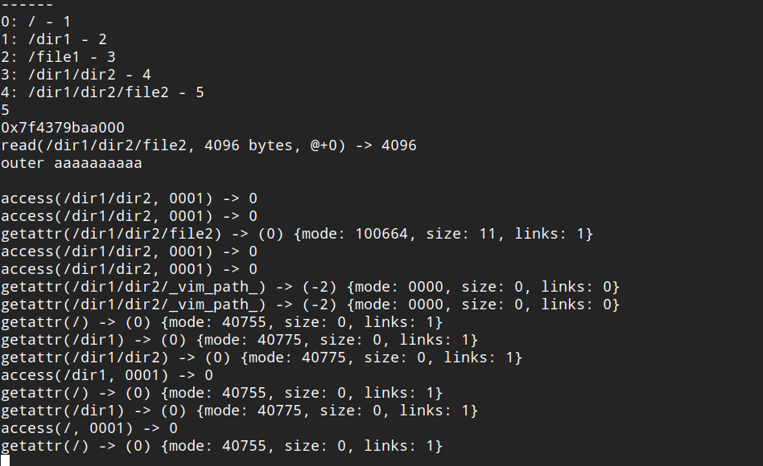

# EXTFileSystem
Programmed a simple EXT Linux filesystem in C using FUSE, an interface that lets users create their own file systems without the need to modify kernel code. The screenshots below show the basic functionality of the program capable of making files, directories and navigating through the filesystem.

#### Installation Instructions

1. Clone the repository
2. Make the makefile
3. Run the nufs executable, this will mount a directory called mnt
4. Without stopping the program, in a new terminal window, go to the mnt directory, this is the filesystem

An example usage of the filesystem can be seen below.

The behind the scenes FUSE system calls can be seen below.

